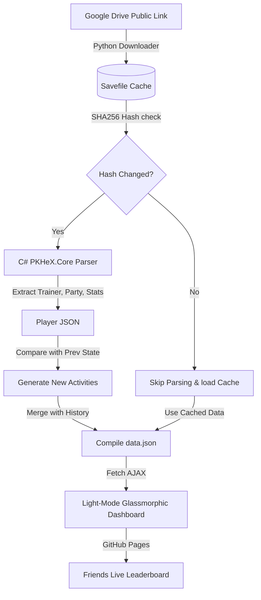

# Pokémon Savefile Progress Tracker

A premium, automated, full-stack savefile tracking and leaderboard platform designed for friend groups playing GBA Pokémon games (Ruby, Sapphire, Emerald, FireRed, LeafGreen) and major ROM hacks (such as *Pokémon Radical Red*, *Pokémon Unbound*, etc.) simultaneously.

It automatically downloads players' `.sav` files from public Google Drive sharing links, parses them with a fast C# engine powered by `PKHeX.Core`, processes state deltas in Python to compile an interactive timeline **Activity Feed**, and hosts a stunning light-mode obsidian-glassmorphic responsive dashboard on GitHub Pages.

---

## 📸 Architecture Diagram



---

## 📂 Repository Structure

- `parser/`: A C# console application linking directly to the local `PKHeX.Core` source project. It parses a `.sav` file and outputs normalized JSON.
- `scripts/`:
  - `update.py`: Main Python orchestrator executing savefile downloads, hashing checks, parser runs, and delta comparisons for Activity generation. Supports multi-game configurations!
  - `generate_mock_data.py`: Developer utility generating detailed multi-game mock data for visual testing.
- `config/`:
  - `players.json`: The player configuration database mapping custom names to Google Drive links and versions.
- `dashboard/`: The static single-page dashboard:
  - `index.html`: Layout containing Leaderboard, Timeline feed, and Player grid.
  - `styles.css`: CSS Design System (light-mode, glassmorphism, responsive grids, official type color pills, glowing badges).
  - `app.js`: Core controller handling data AJAX requests, animated Showdown GIF bindings, Pokéball fallbacks, circular charts, and active-game sub-pill navigations.
- `.github/workflows/`:
  - `track.yml`: Automated GitHub Action running every 10 minutes on cron, updating player states, backing up progress history to Git, and deploying to GitHub Pages.

---

## ⚙️ Setup & Configuration

### Prerequisites
1. **.NET SDK 10.0+**
2. **Python 3.x**

---

### How to Add Players & Configure Multiple Games

Our platform natively supports tracking **multiple games per player** concurrently. Each game run is parsed and displayed separately, and runs are ranked side-by-side on the global leaderboard!

To configure players and their active games, edit [config/players.json](file:///home/duck/bakchodi/pokeTracker/config/players.json):

#### Multi-Game Configuration Format (Recommended)
You can configure a list of distinct game runs under the `"games"` array of each player:

```json
{
  "players": [
    {
      "name": "Marvin",
      "games": [
        {
          "game_name": "Radical Red",
          "drive_url": "https://drive.google.com/file/d/YOUR_DRIVE_ID_1/view?usp=sharing"
        },
        {
          "game_name": "Emerald",
          "drive_url": "https://drive.google.com/file/d/YOUR_DRIVE_ID_2/view?usp=sharing"
        }
      ]
    }
  ]
}
```

#### Single-Game Configuration Format (Backwards Compatible)
For quick single-game setups, you can still use the traditional flat format:

```json
{
  "players": [
    {
      "name": "Marvin",
      "game": "Radical Red",
      "drive_url": "https://drive.google.com/file/d/YOUR_DRIVE_ID_1/view?usp=sharing"
    }
  ]
}
```

> [!IMPORTANT]
> **Google Drive Link Setup:**
> 1. In your emulator cloud sync (e.g. DriveSync on Android or folder sync on PC), set it to sync the active `.sav` battery save to Google Drive.
> 2. Right-click the `.sav` file in Google Drive -> **Share** -> **Get Link**.
> 3. Change permissions from "Restricted" to **"Anyone with the link can view"** (this is critical so that the GitHub Action can download it automatically without requiring credentials).
> 4. Copy the link and paste it into `config/players.json`.

---

## 🚀 Running Locally

You can test and update the entire pipeline on your local computer before pushing changes:

### Step 1: Run the Update Pipeline
To download the latest saves, check hashes, run the parser, and compile `data.json` locally, execute:
```bash
python3 scripts/update.py
```

### Step 2: Serve the Web Dashboard
Since the dashboard uses AJAX requests to load `data.json`, browsers will restrict local files due to CORS. Serve the `dashboard` directory locally using a lightweight server:

```bash
# Start a simple web server
python3 -m http.server 8000 --directory dashboard
```

Now, open your browser and navigate to:
👉 **[http://localhost:8000](http://localhost:8000)**

---

## 🎨 Premium UI Features

- **Sub-Game Toggling**: If a player tracks multiple games, a navigation bar of selector pills appears at the top of their player card. Toggle between games to view their distinct parties, badges, and stats!
- **Persistent State Retention**: Remembers which tab (Party, Badges, Stats) and active sub-game you selected for each player card, retaining these selections seamlessly across live updates!
- **Run-Based Leaderboard**: Global Leaderboards dynamically rank individual runs (Player + Game) side-by-side.
- **Live Activity Feed Timeline**: Detects and displays live achievements in real time (e.g. *"Marvin caught Totodile Lv. 6 in Radical Red!"*).
- **Showdown Animated GIFs**: Automatically resolves Pokémon names into animated Battle Sprites (`play.pokemonshowdown.com`), breathing life into player party tabs.
- **Three-Tier Sprite Fallback**: If an animated Showdown GIF fails, it gracefully falls back to the PokeAPI high-resolution static artwork, and if that fails, a Pokéball item icon, ensuring zero broken images.
- **Gym Badge Tracker**: Displaying obtained gym badges in full color, while locked ones remain in high-density greyscale.
- **HP Progress Bars**: Dynamically shifts color based on health status (green for healthy, orange for warning, red for critical, or greyscale for fainted).
